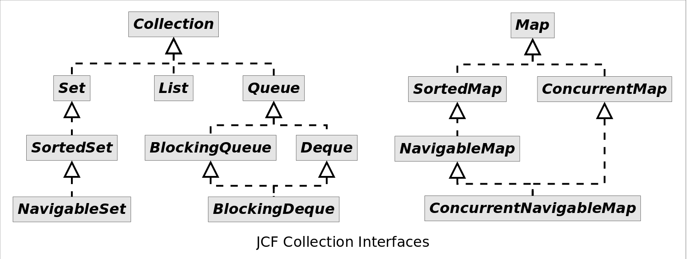

# Java集合框架综述

# 介绍
容器，就是可以容纳其他Java对象的对象。*Java Collections Framework（JCF）*为Java开发者提供了通用的容器，其始于JDK 1.2，优点是：

- 降低编程难度
- 提高程序性能
- 提高API间的互操作性
- 降低学习难度
- 降低设计和实现相关API的难度
- 增加程序的重用性

Java容器里只能放对象，对于基本类型（int, long, float, double等），需要将其包装成对象类型后（Integer, Long, Float, Double等）才能放到容器里。很多时候拆包装和解包装能够自动完成。这虽然会导致额外的性能和空间开销，但简化了设计和编程。


# 集合接口
为了规范容器的行为，统一设计，JCF定义了14种容器接口（collection interfaces）。它们的关系如下图所示：<br>
*Map*接口没有继承自*Collection*接口，因为*Map*表示的是关联式容器而不是集合。


# 集合实现
上述接口的通用实现见下表：
<table align="center"><tr><td colspan="2" rowspan="2" align="center" border="0"></td><th colspan="5" align="center">Implementations</th></tr><tr><th>Hash Table</th><th>Resizable Array</th><th>Balanced Tree</th><th>Linked List</th><th>Hash Table + Linked List</th></tr><tr><th rowspan="4">Interfaces</th><th>Set</th><td><tt>HashSet</tt></td><td></td><td><tt>TreeSet</tt></td><td></td><td><tt>LinkedHashSet</tt></td></tr><tr><th>List</th><td></td><td><tt>ArrayList</tt></td><td></td><td><tt>LinkedList</tt></td><td></td></tr><tr><th>Deque</th><td></td><td><tt>ArrayDeque</tt></td><td></td><td><tt>LinkedList</tt></td><td></td></tr><tr><th>Map</th><td><tt>HashMap</tt></td><td></td><td><tt>TreeMap</tt></td><td></td><td><tt>LinkedHashMap</tt></td></tr></table>


# 接口规范

## Collection
Since1.2<br>
　集合类的根接口，定义了集合类的基本操作。

```java
public interface Collection<E> extends Iterable<E> {
    
    boolean add(E e); //添加元素
    
    boolean addAll(Collection<? extends E> c); //将指定集合中的所有元素添加到此集合中
    
    void clear(); //从此集合中删除所有元素
    
    boolean contains(Object o); //如果此collection包含指定的元素，则返回true
    
    boolean containsAll(Collection<?> c); //如果此collection包含指定collection中的所有元素，则返回true。
    
    boolean equals(Object o); //将指定对象与此集合进行比较判断是否相等
    
    int hashCode(); //返回此集合的哈希码值
    
    boolean isEmpty(); //如果此collection不包含任何元素，则返回true。
    
    Iterator<E> iterator(); //返回此集合中迭代器。
    
    boolean remove(Object o); //从该集合中删除指定元素的第一个匹配项（如果存在）
    
    boolean removeAll(Collection<?> c); //删除此集合的所有元素，这些元素也包含在指定的集合中。
    
    boolean retainAll(Collection<?> c); //仅保留此集合中包含在指定集合中的元素
    
    int size(); //返回此集合中的元素数
    
    Object[] toArray(); //返回包含此集合中所有元素的数组
    
    <T> T[] toArray(T[] a); //返回一个包含此collection中所有元素的数组;返回数组的运行时类型是指定数组的运行时类型
    
    //1.8新增接口
    
    default boolean removeIf(Predicate<? super E> filter) {} // 删除此集合中满足给定条件的所有元素。
    
    default Spliterator<E> spliterator() {} // 返回此集合中可并行的迭代器
    
    default Stream<E> stream() {} //返回以此集合为源的Stream
    
    default Stream<E> parallelStream() {} //以此集合作为源返回可以并行的Stream。
}
```

### Queue 
队列 Since1.5<br>
　队列继承自Collection，除了基本的集合操作外，还提供额外的插入、删除和检索的方法。这些方法都以两种形式存在：一种在操作失败时抛出异常，另一种在操作失败时返回特殊值（null或false，具体取决于操作）。<br>

队列的几种类型：
- FIFO队列：以FIFO（先进先出）的方式对元素进行排序，新增元素放在队尾，每次获取队首的元素。
- 优先级队列：根据提供的比较器或元素的自然顺序对元素进行排序。每次获取优先级最高的元素。
- 栈：以LIFO（后进先出）的方式对元素进行排序，新增元素放在队首，每次获取队首的元素。

方法摘要:<br>
<table align="center"> <tr> <td></td> <td>Throws exception</td> <td>Returns special value</td> </tr> <tr> <th>Insert</th> <td>add(e)</td> <td>offer(e)</td> </tr> <tr> <th>Remove</th> <td>remove()</td> <td>poll()</td> </tr> <tr> <th>Examine</th> <td>element()</td> <td>peek()</td> </tr> </table>
方法详情：<br><br>

```java
public interface Queue<E> extends Collection<E> {
    
    //Throws exception
    
    boolean add(E e); //添加元素到队尾，若队列已满，抛出IllegalStateException异常
    
    E remove(); //返回并删除队首元素，如队列为空，抛出NoSuchElementException异常
    
    E element(); //返回队首元素但不删除，如队列为空，则抛出异常。
    
    
    //Returns special value
    
    boolean offer(E e); //若队列容量未达到限制，则将元素插入队尾，成功返回true，如果当前没有可用空间则返回false。
    
    E poll(); //返回并删除队首元素，如果此队列为空，则返回null
    
    E peek(); //返回队首元素但不删除，如果此队列为空，则返回null。
}
```

#### BlockingQueue
阻塞队列，since 1.5<br>
　BlockingQueue在Queue的基础上增加了阻塞和超时两种类型的方法，阻塞方法和超时方法(超时方法超时后直接放回false或null，不会阻塞)。<br>
　BlockingQueue的实现是线程安全的，主要用于生产者 - 消费者队列，可以有多个生产者和多个消费者。<br>
　在BlockingQueue中，生产者往队列中添加元素(put方法)，若队列已满，会进入阻塞状态，直到队列中有可用空间，消费者从队列中取元素时，若队列为空，会进入阻塞状态，直到队列中放入元素。

方法摘要:<br>
<table align="center"> <tr> <td></td> <td>Throws exception</td> <td>Special value</td> <td>Blocks</td> <td>Times out</td> </tr> <tr> <th>Insert</th> <td>add(e)</td> <td>offer(e)</td> <td>put(e)</td> <td>offer(e, time, unit)</td> </tr> <tr> <th>Remove</th> <td>remove()</td> <td>poll()</td> <td>take()</td> <td>poll(time, unit)</td> </tr> <tr> <th>Examine</th> <td>element()</td> <td>peek()</td> <td>not applicable</td> <td>not applicable</td> </tr> </table>
方法详情:<br><br>

```java
public interface BlockingQueue<E> extends Queue<E> {
    
    //Blocks　method
    
    void put(E e) throws InterruptedException; //添加元素到队尾，若队列已满，阻塞线程，等待队列空间变为可用
    
    E take() throws InterruptedException; //返回并删除队首元素，若此时队列为空，阻塞线程，等待队列中放入元素
    
    
    //Time out method
    
    //添加元素到队尾，若队列已满，阻塞线程，在指定的时间内等待队列空间变为可用，超时后返回false
    boolean offer(E e, long timeout, TimeUnit unit) throws InterruptedException; 
    
   //返回并删除队首元素，若队列为空，阻塞线程，在指定的时间内等待队列中放入元素，超时后返回false
    E poll(long timeout, TimeUnit unit) throws InterruptedException; 
    
    int remainingCapacity(); //返回队列剩余容量，如果是无界队列，返回Integer.MAX_VALUE
    
    int drainTo(Collection<? super E> c); //将队列中所有元素转移到指定集合中
    
    int drainTo(Collection<? super E> c, int maxElements); //将队列中所有元素转移到指定集合中,可以指定最大可转移的元素数量
}
```

##### TransferQueue
传输队列，since1.7

　TransferQueue继承自BlockingQueue。TransferQueue提供了3种转移元素的方式：
- 生产者往队列中添加元素时，若此时有处于阻塞状态的消费者，会立即执行并将元素传输给消费者；否则将元素e插入到队尾，生产者进入阻塞状态，直到有消费者取走该元素。
- 生产者往队列中添加元素时，若此时有处于阻塞状态的消费者，会立即执行并将元素传输给消费者；否则直接返回false，不会将元素添加到队列中。
- 生产者往队列中添加元素时，若此时有处于阻塞状态的消费者，会立即执行并将元素传输给消费者；否则将元素e插入到队尾，在指定时间内等待元素被消费者取出，超时则返回false，同时将该元素从队列中移除。

方法详情:<br>
```java
public interface TransferQueue<E> extends BlockingQueue<E> {
    
    //生产者往队列中添加元素时，若此时有处于阻塞状态的消费者，会立即执行并将元素传输给消费者；否则将元素e插入到队尾，生产者进入阻塞状态，直到有消费者取走该元素。
    void transfer(E e) throws InterruptedException; 
       
    //生产者往队列中添加元素时，若此时有处于阻塞状态的消费者，会立即执行并将元素传输给消费者；否则直接返回false，不会将元素添加到队列中。
    boolean tryTransfer(E e); 
       
    //生产者往队列中添加元素时，若此时有处于阻塞状态的消费者，会立即执行并将元素传输给消费者；否则将元素e插入到队尾，在指定时间内等待元素被消费者取出，超时则返回false，同时将该元素从队列中移除。
    boolean tryTransfer(E e, long timeout, TimeUnit unit) throws InterruptedException;
        
    boolean hasWaitingConsumer(); //如果至少有一个处于阻塞状态的消费者，则返回true
    
    int getWaitingConsumerCount(); //处于阻塞状态的消费者数量
}
```

#### Deque
双端队列 since1.6

　　继承自队列，在队列的基础上增加了直接操作队首或队尾的方法，可以用来实现FIFO，LIFO（栈）两种数据结构。

方法摘要:<br>
<table align="center"> <tr> <td></td> <th colspan="2">First Element (Head)</th> <th colspan="2">Last Element (Tail)</th> </tr> <tr> <td></td> <td>Throws exception</td> <td>Special value</td> <td>Throws exception</td> <td>Special value</td> </tr> <tr> <th>Insert</th> <td>addFirst(e)</td> <td>offerFirst(e)</td> <td>addLast(e)</td> <td>offerLast(e)</td> </tr> <tr> <th>Remove</th> <td>removeFirst()</td> <td>pollFirst()</td> <td>removeLst()</td> <td>pollLast()</td> </tr> <tr> <th>Examine</th> <td>getFirst()</td> <td>peekFirst()</td> <td>getLast()</td> <td>peekLast()</td> </tr> </table>


方法详情:<br>
```java
public interface Deque<E> extends Queue<E> {
    
    //Throws exception
    
    boolean add(E e); //添加元素到队尾，若队列已满，抛出IllegalStateException异常
    void addFirst(E e); //添加元素到队首，若队列已满，抛出IllegalStateException异常
    void addLast(E e); //添加元素到队尾，若队列已满，抛出IllegalStateException异常
    
    E remove(); //返回并删除队首元素，如队列为空，抛出NoSuchElementException异常
    E removeFirst(); //返回并删除队首元素，如队列为空，抛出NoSuchElementException异常
    E removeLast(); //返回并删除队首元素，如队列为空，抛出NoSuchElementException异常
    
    E element(); //返回队首元素但不删除，如果此队列为空，则抛出异常
    E getFirst(); //返回队首元素但不删除，如果此队列为空，则抛出异常
    E getLast(); //返回队尾元素但不删除，如果此队列为空，则抛出异常
    
    
    //Returns special value
    
    boolean offer(E e); //添加元素到队尾，若队列已满，则返回false。
    boolean offerFirst(E e); //添加元素到队首，若队列已满，则返回false。
    boolean offerLast(E e); //添加元素到队尾，若队列已满，则返回false。
    
    E poll(); //返回并删除队首元素，如队列为空，则返回null
    E pollFirst(); //返回并删除队首元素，如队列为空，则返回null
    E pollLast(); //返回并删除队尾元素，如队列为空，则返回null
    
    E peek(); //返回队首元素但不删除，如队列为空，则返回null。
    E peekFirst(); //返回队首元素但不删除，如队列为空，则返回null。
    E peekLast(); //返回队尾元素但不删除，如队列为空，则返回null。
    
    //Stack method
    
    void push(E e);//向栈顶插入元素，若队列已满，则抛出IllegalStateException异常
    
    E pop();//弹出栈顶元素，若队列为空，则抛出NoSuchElementException异常
    
   
    boolean removeFirstOccurrence(Object o); //删除队列中第一个与指定元素相等的元素
    
    boolean removeLastOccurrence(Object o); //删除队列中最后一个与指定元素相等的元素
    
    Iterator<E> descendingIterator(); //获取队列的倒序迭代器
}
```

##### BlockingDeque
阻塞双端队列 since1.6

　　继承自BlockingQueue和Deque，增加了直接操作队首或队尾元素的阻塞和超时方法。
  　
  
方法摘要:<br>
<table align="center"> <tr><th colspan="5">First  Element (Head)</th></tr> <tr> <td></td> <td>Throws exception</td> <td>Special value</td> <td>Blocks</td> <td>Times out</td> </tr> <tr> <th>Insert</th> <td>addFirst(e)</td> <td>offerFirst(e)</td> <td>putFirst(e)</td> <td>offerFirst(e, time, unit)</td> </tr> <tr> <th>Remove</th> <td>removeFirst()</td> <td>pollFirst()</td> <td>takeFirst()</td> <td>pollFirst(time, unit)</td> </tr> <tr> <th>Examine</th> <td>getFirst()</td> <td>peekFirst()</td> <td>not applicable</td> <td>not applicable</td> </tr> <tr><th colspan="5">Last Element (Tail)</th></tr> <tr> <td></td> <td>Throws exception</td> <td>Special value</td> <td>Blocks</td> <td>Times out</td> </tr> <tr> <th>Insert</th> <td>addLast(e)</td> <td>offerLast(e)</td> <td>putLast(e)</td> <td>offerLast(e, time, unit)</td> </tr> <tr> <th>Remove</th> <td>removeLast()</td> <td>pollLast()</td> <td>takeLast()</td> <td>pollLast(time, unit)</td> </tr> <tr> <th>Examine</th> <td>getLast()</td> <td>peekLast()</td> <td>not applicable</td> <td>not applicable</td> </tr> </table>

方法详情:<br>

```java
public interface BlockingDeque<E> extends BlockingQueue<E>, Deque<E> {
    
    //Blocks
    
    void put(E e) throws InterruptedException; //添加元素到队尾，若队列已满，阻塞线程，等待队列空间变为可用
    void putFirst(E e) throws InterruptedException;  //添加元素到队首，若队列已满，阻塞线程，等待队列空间变为可用
    void putLast(E e) throws InterruptedException; //添加元素到队尾，若队列已满，阻塞线程，等待队列空间变为可用
    
    E take() throws InterruptedException; //返回并删除队首元素，若队列为空，阻塞线程，等待队列中被放入元素
    E takeFirst() throws InterruptedException; //返回并删除队首元素，若队列为空，阻塞线程，等待队列中被放入元素
    E takeLast() throws InterruptedException; //返回并删除队尾元素，若队列为空，阻塞线程，等待队列中被放入元素
    
    
    //Time out
    
    //添加元素到队尾，若队列已满，阻塞线程，等待队列空间变为可用，在指定的时间内等待队列空间变为可用，超时后返回false
    boolean offer(E e, long timeout, TimeUnit unit) throws InterruptedException; 
   
    //将指定的元素插入队首，若此时队列已满，阻塞线程，在指定的时间内等待队列空间变为可用，超时后返回false
    boolean offerFirst(E e, long timeout, TimeUnit unit) throws InterruptedException;
    
    //将指定的元素插入队尾，若此时队列已满，阻塞线程，在指定的时间内等待队列空间变为可用，超时后返回false
    boolean offerLast(E e, long timeout, TimeUnit unit) throws InterruptedException;
    
    //返回并删除队首元素，若队列为空，阻塞线程，在指定的时间内等待队列空间中被放入元素，超时后返回false                        
    E poll(long timeout, TimeUnit unit) throws InterruptedException;
    
    //返回并删除队首元素，若队列为空，阻塞线程，在指定的时间内等待队列空间中被放入元素，超时后返回false
    E pollFirst(long timeout, TimeUnit unit) throws InterruptedException; 
    
    //返回并删除队尾元素，若队列为空，阻塞线程，在指定的时间内等待队列空间中被放入元素，超时后返回false
    E pollLast(long timeout, TimeUnit unit) throws InterruptedException; 
    
}
```

### List
列表 since1.2

　List可以存储重复元素。List是有序的集合，可以通过索引（列表中的位置）操作元素。<br >
　List接口提供了一个特殊的迭代器，称为ListIterator，它允许在便利过程中进行元素插入和替换，以及Iterator接口提供的常规操作之外的双向访问。该迭代器还可以指定遍历开始的位置。

方法详情:<br>

```java
public interface List<E> extends Collection<E> {
    
    void add(int index, E element); //将元素插入到此列表中的指定位置
    
    boolean addAll(int index, Collection<? extends E> c); //将指定集合的所有元素插入此列表中的指定位置
    
    E remove(int index);//从该列表中删除指定元素的第一个匹配项（如果存在）
    
    E get(int index); //返回此列表中指定位置的元素
    
    int indexOf(Object o); //返回此列表中第一次出现的指定元素的索引，如果此列表不包含该元素，则返回-1。
    
    int lastIndexOf(Object o);//返回此列表中指定元素最后一次出现的索引，如果此列表不包含该元素，则返回-1。
    
    //返回此列表中元素的列表迭代器,除了Iterator接口的功能外，还支持双向迭代，元素替换，元素插入和索引检索
    ListIterator<E> listIterator();
    
    //从列表中的指定位置开始，返回列表中元素的列表迭代器，除了Iterator接口的功能外，还支持双向迭代，元素替换，元素插入和索引检索
    ListIterator<E> listIterator(int index);
    
    List<E> subList(int fromIndex, int toIndex);//返回指定开始和结束位置的集合视图
    
    //1.8新增接口 
    default void replaceAll(UnaryOperator<E> operator) {} // 对每个元素执行operator指定的操作，并用操作结果来替换原来的元素。
    
    default void sort(Comparator<? super E> c) {} //根据c指定的比较规则对容器元素进行排序
}
```

### Set
since1.2

　无重复元素的集合。<br>
  判断是否重复的方法由具体实现类决定，HashSet使用equals方法实现，TreeSet使用集合比较器或元素自然排序实现。

方法详情:<br>
```java
public interface Set<E> extends Collection<E> {
    //Set中的方法与Collection一致
}
```
#### SortedSet

since1.2

　元素按照一定顺序进行存储，如二叉查找树和红黑树等，此接口提供基于排序集合的一些操作，如获取首部元素，获取尾部元素等，至于首部和尾部到底是哪一个元素，与实现者采用的数据结构有关。

```java
public interface SortedSet<E> extends Set<E> {
    
    Comparator<? super E> comparator(); //返回set使用的比较器，若使用的是自然排序，则返回null
    
    SortedSet<E> subSet(E fromElement, E toElement); //返回set的视图，其元素范围从fromElement（包括）到toElement（不包括）
    
    SortedSet<E> headSet(E toElement); //返回set的视图，其元素从首部到toElement（不包括）
    
    SortedSet<E> tailSet(E fromElement);  //返回set的视图，其元素从fromElement（包括）到尾部
    
    E first(); //返回set的首部元素
    
    E last(); //返回set的尾部元素
    
    //1.8新增方法
    default Spliterator<E> spliterator() {} //返回支持并行的迭代器
}
```
##### NavigableSet
since1.6

　增强了SortedSet接口，增加的功能如下<br>

- 查询集合中最接近指定元素的元素，方法lower，floor，ceiling和higher返回元素分别小于，小于或等于，大于或等于，大于给定元素的临近元素，如果没有则返回null。
- 获取并删除首部或尾部元素
- 可以按升序或降序访问和遍历NavigableSet，descendingSet()方法返回集合的反向视图，所有操作都会反向。
- 在SortedSet的基础上增强了视图的获取，可以指定视图是否包含fromElement和toElement

　为避免歧义，建议实现的集合不要保存null元素<br>
　方法subSet（E，E），headSet（E）和tailSet（E）返回类型为SortedSet，用以对SortedSet的现有实现进行兼容。但鼓励此接口的扩展和实现覆盖这些方法并返回NavigableSet。

方法详情:<br>
```java
public interface NavigableSet<E> extends SortedSet<E> {
    
    E lower(E e); //返回set中小于或等于给定元素的最大元素，没有则返回null。
    
    E higher(E e); //返回set中大于给定元素的最小元素，没有则返回null。
    
    E floor(E e); //返回set中小于或等于给定元素的最大元素，没有则返回null。
    
    E ceiling(E e); //返回set中大于或等于给定元素的最小元素，没有则返回null。
    
    E pollFirst(); //返回并删除set中的首部元素
    
    E pollLast(); //返回并删除set中的尾部元素
    
    Iterator<E> iterator();//返回升序遍历的迭代器
    
    Iterator<E> descendingIterator();//返回降序遍历的迭代器
    
    //返回set的视图，其元素范围从fromElement到toElement，是否包括根据fromInclusive和toInclusive决定
    NavigableSet<E> subSet(E fromElement, boolean fromInclusive,E toElement,   boolean toInclusive);
    
    //返回set的视图，其元素从首部到toElement，inclusive为true时包括toElement
    NavigableSet<E> headSet(E toElement, boolean inclusive);
    
    //返回set的视图，其元素从fromElement到尾部，inclusive为true时包括fromElement
    NavigableSet<E> tailSet(E fromElement, boolean inclusive);
}
```
## Map
since1.2
  可以容纳键值映射关系的容器，特点如下
  
- 键不能重复
- 一个键只能映射一个值
- 提供三个集合视图，分别用于遍历键、值和键值映射

判断键是否重复的方法由具体实现类决定，HashSet使用equals方法实现，TreeSet使用集合比较器或元素自然排序实现。<br>

方法详情:<br>
```java
public interface Map<K,V> {
    
    int size(); //返回map中的元素个数
    
    boolean isEmpty(); //若map不包含任何元素，则返回true
    
    boolean containsKey(Object key); //若包含指定键的映射，则返回true
    
    boolean containsValue(Object value); //若包含指定值的映射，则返回true
    
    V get(Object key);//返回指定键映射的值
    
    V put(K key, V value); //保存键值映射关系
    
    V remove(Object key); //根据指定的键删除映射
    
    void putAll(Map<? extends K, ? extends V> m); //将指定map中的所有的映射添加到此map
    
    void clear(); //删除map中的所有映射
    
    Set<K> keySet(); //返回键的集合视图
    
    Collection<V> values(); //返回值得集合视图
    
    Set<Map.Entry<K, V>> entrySet(); //返回键值的集合视图
    
    boolean equals(Object o); //判断两个对象是否相等
    
    int hashCode(); //返回hash码值
    
    //1.8新增接口
    //按照给定的key查询Map中对应的value，如果没有找到则返回defaultValue
    default V getOrDefault(Object key, V defaultValue) {} 
    
    //对Map中的每个映射执行action指定的操作
    default void forEach(BiConsumer<? super K, ? super V> action) {} 
    
    //对Map中的每个映射执行function指定的操作，并用function的执行结果替换原来的value
    default void replaceAll(BiFunction<? super K, ? super V, ? extends V> function) {} 
    
    //只有在不存在key值的映射或映射值为null时，才将value指定的值放入到Map中，否则不对Map做更改
    default V putIfAbsent(K key, V value) {} 
    
    //当前Map中key正好映射到value时才删除该映射
    default boolean remove(Object key, Object value){} 
    
    //只有在当前Map中**key的映射存在且等于oldValue时**才用newValue去替换原来的值
    default boolean replace(K key, V oldValue, V newValue) {}     
    
    default V replace(K key, V value) {} //只有在当前Map中key的映射存在时才用value去替换原来的值
    
    //只有在当前Map中**key的映射存在且等于oldValue时**才用newValue去替换原来的值
    default V computeIfAbsent(K key,Function<? super K, ? extends V> mappingFunction) {} 
    
    //只有在当前Map中不存在key值的映射或映射值为null时，才调用mappingFunction，并在mappingFunction执行结果非null时，将结果跟key关联
    default V computeIfPresent(K key,BiFunction<? super K, ? super V, ? extends V> remappingFunction) {}
    
    //只有在当前Map中存在key值的映射且非null时，才调用remappingFunction，如果remappingFunction执行结果为null，则删除key的映射，否则使用该结果替换key原来的映射
    default V compute(K key,BiFunction<? super K, ? super V, ? extends V> remappingFunction) {}
    
    //1.如果Map中key对应的映射不存在或者为null，则将value（不能是null）关联到key上；
    //2.否则执行remappingFunction，如果执行结果非null则用该结果跟key关联，否则在Map中删除key的映射．
    default V merge(K key, V value,BiFunction<? super V, ? super V, ? extends V> remappingFunction) {}
    
    //映射
    interface Entry<K,V> {
        K getKey(); //获取映射中的key
        
        V getValue(); //获取映射中的值
        
        V setValue(V value); //设置映射中的值
    }
    
}
```
### SortedMap
since1.2
　映射根据key值进行顺序存储，如二叉查找树和红黑树等，此接口提供基于排序的一些操作，如获取首部key值，获取尾部key值等。

方法详情:<br>
```java
public interface SortedMap<K,V> extends Map<K,V> {
    
    Comparator<? super K> comparator(); //返回map使用的比较器，若使用自然排序，返回null
    
    SortedMap<K,V> subMap(K fromKey, K toKey); //返回map的视图，key的范围从fromKey（包含）到toKey（不包括）
    
    SortedMap<K,V> headMap(K toKey); //返回map的视图，key的范围从首部到toKey（不包括）
    
    SortedMap<K,V> tailMap(K fromKey); //返回map的视图，key的范围从fromKey（包含）到尾部（不包括）
  
    K firstKey(); //返回map中的第一个键
    
    K lastKey(); //返回map中的最后一个键
    
}
```
#### NavigableMap
since1.6

　增强了SortedMap接口，增加的功能如下<br>

- 查询map中最接近指定key的映射，方法lowerEntry，floorEntry，ceilingEntry和higherKey分别返回小于，小于或等于，大于或等于，大于指定key的映射，如果没有则返回null
- 查询map中最接近指定key的key，方法lowerKey，floorKey，ceilingKey和higherEntry分别返回小于，小于或等于，大于或等于，大于指定key的key，如果没有则返回null
- 获取并删除首部或尾部映射pollFirstEntry，pollLastEntry
- descendingKeySet方法返回键的的逆序set视图，对于视图的操作会被反向。
- descendingMap方法可以返回映射的逆序的map视图，对于视图的操作会被反向
- navigableKeySet返回支持导航操作的key视图，可以进行逆序迭代
- 在SortedMap的基础上增强了视图的获取，可以指定视图是否包含fromKey和toKey

方法详情:<br>
```java
public interface NavigableMap<K,V> extends SortedMap<K,V> {
    
    Map.Entry<K,V> lowerEntry(K key); //返回小于给定key的最大映射，没有则返回null。
    
    K lowerKey(K key); //返回小于给定key的最大key，没有则返回null。
    
    Map.Entry<K,V> floorEntry(K key); //返回小于或等于给定key的最大映射，没有则返回null。
    
    K floorKey(K key); //返回小于或等于给定key的最大key，没有则返回null。
    
    Map.Entry<K,V> ceilingEntry(K key);//返回大于或等于给定key的最小映射，没有则返回null。
    
    K ceilingKey(K key); //返回大于或等于给定key的最小key，没有则返回null。
    
    Map.Entry<K,V> higherEntry(K key);  //返回大于给定key的最小映射，没有则返回null。
    
    K higherKey(K key); //返回大于给定key的最小映射key，没有则返回null。
    
    Map.Entry<K,V> firstEntry(); //返回第一个映射
    
    Map.Entry<K,V> lastEntry(); //返回最后一个映射
    
    Map.Entry<K,V> pollFirstEntry(); //返回并删除第一个映射
    
    Map.Entry<K,V> pollLastEntry(); //返回并删除最后一个映射
    
    NavigableMap<K,V> descendingMap(); //返回逆序的映射视图，对视图的操作将被反向
    
    NavigableSet<K> descendingKeySet(); //返回逆序的key视图，对视图的操作将被反向
    
    NavigableSet<K> navigableKeySet(); //返回支持导航操作的key视图
    
    //返回map的视图，其映射范围从fromKey到toKey，是否包括根据fromInclusive和toInclusive决定
    NavigableMap<K,V> subMap(K fromKey, boolean fromInclusive,K toKey,   boolean toInclusive);
    
    //返回map的视图，其元素从首部到toKey，inclusive为true时包括toKey
    NavigableMap<K,V> headMap(K toKey, boolean inclusive);
    
    //返回map的视图，其元素从fromKey到尾部，inclusive为true时包括fromKey
    NavigableMap<K,V> tailMap(K fromKey, boolean inclusive);
}
```

### ConcurrentMap
since1.5

　提供线程安全性和原子性保证的映射

方法详情:<br>
```java
public interface ConcurrentMap<K, V> extends Map<K, V> {
    //无新增接口
}
```
#### ConcurrentNavigableMap
since1.6

　ConcurrentMap支持NavigableMap操作

方法详情:<br>
```java
public interface ConcurrentNavigableMap<K,V> extends ConcurrentMap<K,V>, NavigableMap<K,V>{
    
    ConcurrentNavigableMap<K,V> subMap(K fromKey, boolean fromInclusive,
                                       K toKey,   boolean toInclusive);
    
    ConcurrentNavigableMap<K,V> headMap(K toKey, boolean inclusive);
    
    ConcurrentNavigableMap<K,V> tailMap(K fromKey, boolean inclusive);
    
    ConcurrentNavigableMap<K,V> subMap(K fromKey, K toKey);
    
    ConcurrentNavigableMap<K,V> headMap(K toKey);
    
    ConcurrentNavigableMap<K,V> tailMap(K fromKey);
    
    ConcurrentNavigableMap<K,V> descendingMap();
    
    NavigableSet<K> navigableKeySet();
    
    NavigableSet<K> keySet();
    
    NavigableSet<K> descendingKeySet();
}
```


