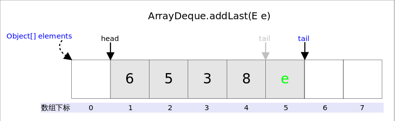

https://github.com/CarpenterLee/JCFInternals/blob/master/markdown/4-Stack%20and%20Queue.md

# 总体介绍
ArrayDeque实现了Deque接口，*Deque*的含义是“double ended queue”，即双端队列，它既可以当作栈（LIFO）使用，也可以当作队列（FIFO）使用。
## 数据结构：
ArrayDeque使用数组存储元素，为了满足可以同时在数组两端插入或删除元素的需求，该数组还必须是循环的，即**循环数组（circular array）**，也就是说数组的任何一点都可能被看作起点或者终点。
另外，ArrayDeque的数组为可变数组，数组长度必为2的幂次方，每次扩容后长度变为原来的两倍。


上图中我们看到，**`head`指向首端第一个有效元素，`tail`指向尾端第一个可以插入元素的空位**。因为是循环数组，所以`head`不一定总等于0，`tail`也不一定总是比`head`大。
## 并发
ArrayDeque不是线程安全的。
## 性能
ArrayDeque添加、获取和删除的操作为常数时间。
## 遍历
ArrayDeque提供了升序迭代器和降序迭代器


# 源码
ArrayDeque继承自AbstractCollection类，并且实现了Deque，Cloneable和Serializable接口，Cloneable接口则表示可以进行拷贝，Serializable接口表示ArrayDeque可以被序列化。
因为实现了Deque接口，ArrayDeque可以直接操作首部和尾部的元素。
## 成员变量
```java
public class ArrayDeque<E> extends AbstractCollection<E>
                           implements Deque<E>, Cloneable, Serializable{
    
    transient Object[] elements; //用于存储元素的数组
    
    transient int head; //指向首端第一个有效元素位
    
    transient int tail; //指向尾端第一个可以插入元素的空位
    
    private static final int MIN_INITIAL_CAPACITY = 8;//数组的初始容量，数组最大大小为2^30
    
}
```
## 重要方法
### addFirst()

`addFirst(E e)`的作用是在*Deque*的首端插入元素，也就是在`head`的前面插入元素，在空间足够且下标没有越界的情况下，只需要将`elements[--head] = e`即可。


实际需要考虑：1.空间是否够用，以及2.下标是否越界的问题。上图中，如果`head`为`0`之后接着调用`addFirst()`，虽然空余空间还够用，但`head`为`-1`，下标越界了。下列代码很好的解决了这两个问题。
```Java
//addFirst(E e)
public void addFirst(E e) {
    if (e == null)//不允许放入null
        throw new NullPointerException();
    elements[head = (head - 1) & (elements.length - 1)] = e;//2.下标是否越界
    if (head == tail)//1.空间是否够用
        doubleCapacity();//扩容
}
```

上述代码我们看到，**空间问题是在插入之后解决的**，因为`tail`总是指向下一个可插入的空位，也就意味着`elements`数组至少有一个空位，所以插入元素的时候不用考虑空间问题。

下标越界的处理解决起来非常简单，`head = (head - 1) & (elements.length - 1)`就可以了，**这段代码相当于取余，同时解决了`head`为负值的情况**。因为`elements.length`必需是`2`的指数倍，`elements - 1`就是二进制低位全`1`，跟`head - 1`相与之后就起到了取模的作用，如果`head - 1`为负数（其实只可能是-1），则相当于对其取相对于`elements.length`的补码。

下面再说说扩容函数`doubleCapacity()`，其逻辑是申请一个更大的数组（原数组的两倍），然后将原数组复制过去。过程如下图所示：


图中我们看到，复制分两次进行，第一次复制`head`右边的元素，第二次复制`head`左边的元素。

```Java
//doubleCapacity()
private void doubleCapacity() {
    assert head == tail;
    int p = head;
    int n = elements.length;
    int r = n - p; // head右边元素的个数
    int newCapacity = n << 1;//原空间的2倍
    if (newCapacity < 0)
        throw new IllegalStateException("Sorry, deque too big");
    Object[] a = new Object[newCapacity];
    System.arraycopy(elements, p, a, 0, r);//复制右半部分，对应上图中绿色部分
    System.arraycopy(elements, 0, a, r, p);//复制左半部分，对应上图中灰色部分
    elements = (E[])a;
    head = 0;
    tail = n;
}
```

### addLast()

`addLast(E e)`的作用是在*Deque*的尾端插入元素，也就是在`tail`的位置插入元素，由于`tail`总是指向下一个可以插入的空位，因此只需要`elements[tail] = e;`即可。插入完成后再检查空间，如果空间已经用光，则调用`doubleCapacity()`进行扩容。



```Java
public void addLast(E e) {
    if (e == null)//不允许放入null
        throw new NullPointerException();
    elements[tail] = e;//赋值
    if ( (tail = (tail + 1) & (elements.length - 1)) == head)//下标越界处理
        doubleCapacity();//扩容
}
```

下标越界处理方式`addFirt()`中已经讲过，不再赘述。

### pollFirst()

`pollFirst()`的作用是删除并返回*Deque*首端元素，也即是`head`位置处的元素。如果容器不空，只需要直接返回`elements[head]`即可，当然还需要处理下标的问题。由于`ArrayDeque`中不允许放入`null`，当`elements[head] == null`时，意味着容器为空。

```Java
public E pollFirst() {
    E result = elements[head];
    if (result == null)//null值意味着deque为空
        return null;
    elements[h] = null;//let GC work
    head = (head + 1) & (elements.length - 1);//下标越界处理
    return result;
}
```

### pollLast()

`pollLast()`的作用是删除并返回*Deque*尾端元素，也即是`tail`位置前面的那个元素。

```Java
public E pollLast() {
    int t = (tail - 1) & (elements.length - 1);//tail的上一个位置是最后一个元素
    E result = elements[t];
    if (result == null)//null值意味着deque为空
        return null;
    elements[t] = null;//let GC work
    tail = t;
    return result;
}
```

### peekFirst()

`peekFirst()`的作用是返回但不删除*Deque*首端元素，也即是`head`位置处的元素，直接返回`elements[head]`即可。

```Java
public E peekFirst() {
    return elements[head]; // elements[head] is null if deque empty
}
```

### peekLast()

`peekLast()`的作用是返回但不删除*Deque*尾端元素，也即是`tail`位置前面的那个元素。

```Java
public E peekLast() {
    return elements[(tail - 1) & (elements.length - 1)];
}
```
### delete()

`delete(i)`的作用是删除位置的元素，并对数组移位，移位操作做了优化处理，竟可能的少移动元素。

```java
//删除指定位置的元素
private boolean delete(int i) {
    checkInvariants();
    final Object[] elements = this.elements;
    final int mask = elements.length - 1;
    final int h = head;
    final int t = tail;
    final int front = (i - h) & mask;
    final int back  = (t - i) & mask;
    
    // 若i到head的长度大于数组有效元素长度，i的位置上没有元素
    if (front >= ((t - h) & mask))
        throw new ConcurrentModificationException();

    // 对删除做了优化，若删除元素更靠近head，删除后前半段的元素后移一位，若删除的元素更靠近tail，删除后后半段元素前移一位。
    if (front < back) {
        //删除元素靠近head
        if (h <= i) {
            //删除元素在head右侧，只需要将head到i的元素右移一位
            System.arraycopy(elements, h, elements, h + 1, front);
        } else { // Wrap around
            //删除元素在head左侧，将0到i的元素右移一位，将数组末位元素放到数组首位，再将head~数组末位元素右移一位
            System.arraycopy(elements, 0, elements, 1, i);
            elements[0] = elements[mask];
            System.arraycopy(elements, h, elements, h + 1, mask - h);
        }
        elements[h] = null;
        head = (h + 1) & mask;
        return false;
    } else {
        //删除元素靠近tail
        if (i < t) { 
            //删除元素在tail左侧，只许将i+1到tial的元素右移一位
            System.arraycopy(elements, i + 1, elements, i, back);
            tail = t - 1;
        } else { // Wrap around
            //删除元素在tail右侧，将i+1~数组末位的元素左移一位，将数组首位元素放到数组末位，再将数组首位到tail的元素左移一位
            System.arraycopy(elements, i + 1, elements, i, mask - i);
            elements[mask] = elements[0];
            System.arraycopy(elements, 1, elements, 0, t);
            tail = (t - 1) & mask;
        }
        return true;
    }
}
```

## 迭代器
### DeqIterator
升序迭代器，通过移动cursor来实现遍历数组，提供remove()方法。
```java
private class DeqIterator implements Iterator<E> {
    private int cursor = head;//cursor指向首端第一个有效元素位
    private int fence = tail;//fence指向尾端第一个可以插入元素的空位
    private int lastRet = -1;//最后一次返回的元素索引
}
```
### remove()
删除元素时，可能造成元素移位，可能会造成cursor跳过一个元素或者重复一个元素，需要对cursor和fence重新设置，设置需要根据具体发生的移位情况确定。
```java
public void remove() {
    if (lastRet < 0)
        throw new IllegalStateException();
    if (!delete(lastRet)) {
        cursor = (cursor + 1) & (elements.length - 1);
        fence = head;
    }
    lastRet = -1;
}
```

### DescendingIterator
降序迭代器，cursor指向末端，通过移动cursor来实现遍历数组，提供remove()方法。
```java
private class DescendingIterator implements Iterator<E> {
    private int cursor = tail;//cursor指向尾端第一个可以插入元素的空位
    private int fence = head;//fence指向首端第一个有效元素位
    private int lastRet = -1;//最后一次返回的元素索引
}
```