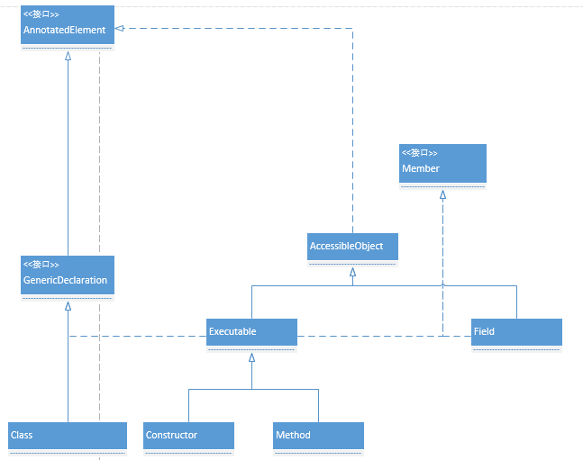

Menber是成员的顶层接口，定义了成员常用的功能。
```java
public interface Member {
    
    //标识类或接口的所有公共成员的集合，包括继承的成员。
    public static final int PUBLIC = 0;
    
    //标识类或接口的已声明成员集。
    public static final int DECLARED = 1;
    
    //返回成员所属的类
    public Class<?> getDeclaringClass();
    
    //返回成员名称
    public String getName();
    
    //返回成员的修饰符
    public int getModifiers();
    
    //如果编译器引入了该成员，则返回true;否则返回false
    public boolean isSynthetic();
    
 }
```

AnnotatedElement，用于操作注解
```java
public interface AnnotatedElement {
    
    default boolean isAnnotationPresent(Class<? extends Annotation> annotationClass) { }
    
    <T extends Annotation> T getAnnotation(Class<T> annotationClass);
    
    Annotation[] getAnnotations();
    
    default <T extends Annotation> T[] getAnnotationsByType(Class<T> annotationClass) { }
     
    default <T extends Annotation> T getDeclaredAnnotation(Class<T> annotationClass) { }
     
    default <T extends Annotation> T[] getDeclaredAnnotationsByType(Class<T> annotationClass) { }
    
    Annotation[] getDeclaredAnnotations();
}

```


AccessibleObject是成员的基类，维护了一个成员变量override(可访问标志)，用于表示成员是否可访问。
AccessibleObject实现了AnnotatedElement接口，可以操作成员上的注解。
```java
public class AccessibleObject implements AnnotatedElement {
    
    //可访问标志
    boolean override;
    
    //将此对象的可访问标志设置为指示的布尔值
    public void setAccessible(boolean flag) throws SecurityException {
            SecurityManager sm = System.getSecurityManager();
            if (sm != null) sm.checkPermission(ACCESS_PERMISSION);
            setAccessible0(this, flag);
    }
    
    //获取此成员的可访问标志的值
    public boolean isAccessible() {
            return override;
    }
    
    //批量将此数组中的成员的可访问标志设置为指示的布尔值，为了提高效率
    public static void setAccessible(AccessibleObject[] array, boolean flag)
        throws SecurityException {
        SecurityManager sm = System.getSecurityManager();
        if (sm != null) sm.checkPermission(ACCESS_PERMISSION);
        for (int i = 0; i < array.length; i++) {
            setAccessible0(array[i], flag);
        }
    }
}
```
Executable是一个抽象类，实现了Member接口，是一个成员；实现了GenericDeclaration接口，可以操作参数上的注解；继承自AccessibleObject，支持可访问控制。Executable是成员方法（构造方法和方法）的基类。
Executable主要是增加了针对方法参数、异常和返回值的功能。
```java
public abstract class Executable extends AccessibleObject
    implements Member, GenericDeclaration {
    
    //返回参数的原始类型数组
    public abstract Class<?>[] getParameterTypes();
    
    //返回参数的泛型类型数组
    public Type[] getGenericParameterTypes() {}
    
    //获取参数的注解类型数组
    public AnnotatedType[] getAnnotatedParameterTypes() {}
    
    //获取异常的原始类型数组
    public abstract Class<?>[] getExceptionTypes();
    
    //获取异常的泛型类型数组
    public Type[] getGenericExceptionTypes() {}
    
    //获取异常的注解类型数组
    public AnnotatedType[] getAnnotatedExceptionTypes() {}
    
    //获取返回值的注解类型
    public abstract AnnotatedType getAnnotatedReturnType();
    
    //获取参数数组
    public Parameter[] getParameters() {}
    
    //获取参数个数
    public int getParameterCount() {
        throw new AbstractMethodError();
    }
    
    //获取参数的注解列表
    public abstract Annotation[][] getParameterAnnotations();
}
```
