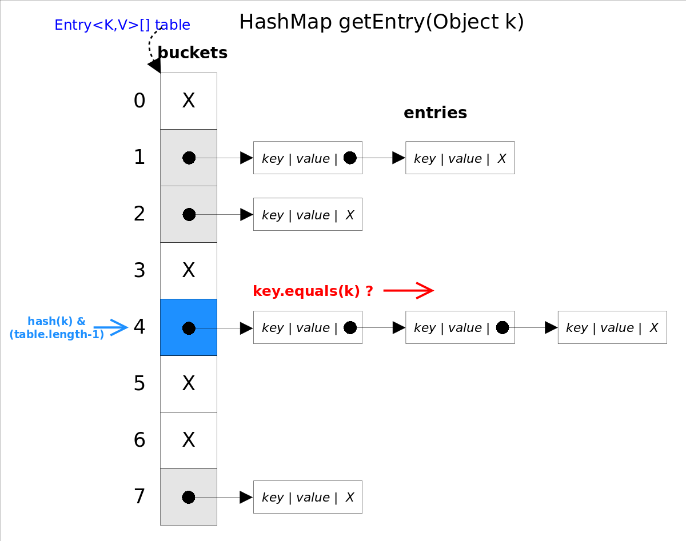

https://github.com/CarpenterLee/JCFInternals/edit/master/markdown/6-HashSet%20and%20HashMap.md

# 总体介绍
*HashSet*和*HashMap*在Java里有着相同的实现，前者仅仅是对后者做了一层包装，也就是说***HashSet*里面有一个*HashMap*（适配器模式）**。

*HashMap*实现了*Map*接口，即允许放入`key`为`null`的元素，也允许插入`value`为`null`的元素。<br>

`HashMap`除了未实现同步外，其余跟`Hashtable`大致相同；
## 数据结构
HashMap使用hash表存储元素，跟*TreeMap*不同，该容器不保证元素顺序，根据需要该容器可能会对元素重新哈希，元素的顺序也会被重新打散，因此不同时间迭代同一个*HashMap*的顺序可能会不同。
根据对冲突的处理方式不同，哈希表有两种实现方式，一种开放地址方式（Open addressing），另一种是冲突链表方式（Separate chaining with linked lists）。**Java *HashMap*采用的是冲突链表方式**。


## 并发
HashSet和HashMap为线程不同步

## 性能
从上图容易看出，如果选择合适的哈希函数，`put()`和`get()`方法可以在常数时间内完成。但在对*HashMap*进行迭代时，需要遍历整个table以及后面跟的冲突链表。因此对于迭代比较频繁的场景，不宜将*HashMap*的初始大小设的过大。
有两个参数可以影响*HashMap*的性能：初始容量（inital capacity）和负载系数（load factor）。初始容量指定了初始`table`的大小，负载系数用来指定自动扩容的临界值。当`entry`的数量超过`capacity*load_factor`时，容器将自动扩容并重新哈希。对于插入元素较多的场景，将初始容量设大可以减少重新哈希的次数。

将对象放入到*HashMap*或*HashSet*中时，有两个方法需要特别关心：`hashCode()`和`equals()`。**`hashCode()`方法决定了对象会被放到哪个`bucket`里，当多个对象的哈希值冲突时，`equals()`方法决定了这些对象是否是“同一个对象”**。所以，如果要将自定义的对象放入到`HashMap`或`HashSet`中，需要*@Override*`hashCode()`和`equals()`方法。
## 遍历
提供key的视图，value的视图和entry的视图，可以分别对key、value和entry进行遍历。

# 源码分析
## 成员变量
```java
public class HashMap<K,V> extends AbstractMap<K,V>
    implements Map<K,V>, Cloneable, Serializable {
    
    static final int DEFAULT_INITIAL_CAPACITY = 1 << 4;//默认初始化大小
    static final int MAXIMUM_CAPACITY = 1 << 30;//最大大小2^30
    static final float DEFAULT_LOAD_FACTOR = 0.75f;//默认的填充因子
    static final int TREEIFY_THRESHOLD = 8;
    static final int UNTREEIFY_THRESHOLD = 6;
    static final int MIN_TREEIFY_CAPACITY = 64;
    
    transient Node<K,V>[] table; //存储元素的数组
    transient Set<Map.Entry<K,V>> entrySet; //映射视图
    transient int size; //元素大小
    transient int modCount; //结构修改次数
    int threshold; //临界值
    final float loadFactor; //填充因子
    
    //用于存储元素的对象
    static class Node<K,V> implements Map.Entry<K,V> {
        final int hash; //hash值
        final K key; 
        V value; 
        Node<K,V> next; //下一个元素
        
        Node(int hash, K key, V value, Node<K,V> next) {
            this.hash = hash;
            this.key = key;
            this.value = value;
            this.next = next;
        }
        
        public final K getKey()        { return key; }
        public final V getValue()      { return value; }
        public final String toString() { return key + "=" + value; }
    }
}
```
## 重要方法
### get()
get(Object key)方法根据指定的key值返回对应的value,从代码中可以看到，add方法调用了getNode(hash,key)方法来获取entry。
思想是首先通过`hash()`函数得到对应`bucket`的下标，然后依次遍历冲突链表，通过`key.equals(k)`方法来判断是否是要找的那个`entry`。

上图中`hash(k)&(table.length-1)`等价于`hash(k)%table.length`，原因是*HashMap*要求`table.length`必须是2的指数，因此`table.length-1`就是二进制低位全是1，跟`hash(k)`相与会将哈希值的高位全抹掉，剩下的就是余数了。<br>

代码如下
```java
public V get(Object key) {
    Node<K,V> e;
    return (e = getNode(hash(key), key)) == null ? null : e.value;
}
final Node<K,V> getNode(int hash, Object key) {
    
    Node<K,V>[] tab; Node<K,V> first, e; int n; K k;
    if ((tab = table) != null && (n = tab.length) > 0 && (first = tab[(n - 1) & hash]) != null) { //(n - 1) & hash 计算出所在的bucket
        if (first.hash == hash && // 如果bucket中的第一个元素与传入的对象相同，直接返回
            ((k = first.key) == key || (key != null && key.equals(k))))
            return first;
        if ((e = first.next) != null) { //若有后继元素
            //该bucket基于红黑树存储
            if (first instanceof TreeNode)
                return ((TreeNode<K,V>)first).getTreeNode(hash, key);//从红黑树查找元素
            //该bucket基于链表存储
            do {
                if (e.hash == hash &&
                    ((k = e.key) == key || (key != null && key.equals(k))))
                    return e;//若找到与key相同的元素，返回
            } while ((e = e.next) != null);//循环链表
        }
    }
    //若table还未初始化或未找到与key相同的元素，返回null
    return null;
}
```
### hash()
计算元素hash码值，若key是null,hash码取0，所以null键保存在数组第一位。
先通过key.hashCode()获取到元素的hashCode，将hashCode向右移16位，高位补0，再与远hashCode做异或运算，得到的结果是，hashCode高16位不变，低16位与原高16位做异或运算。
```java
static final int hash(Object key) {
    int h;
    return (key == null) ? 0 : (h = key.hashCode()) ^ (h >>> 16);
}
```

## 迭代器


