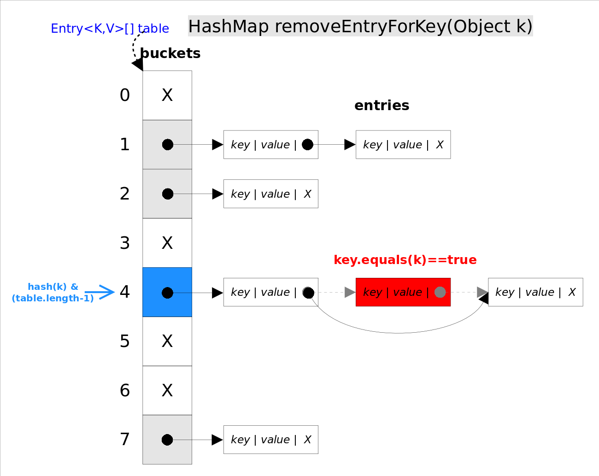

https://github.com/CarpenterLee/JCFInternals/edit/master/markdown/6-HashSet%20and%20HashMap.md

# 总体介绍
*HashSet*和*HashMap*在Java里有着相同的实现，前者仅仅是对后者做了一层包装，也就是说***HashSet*里面有一个*HashMap*（适配器模式）**。

*HashMap*实现了*Map*接口，即允许放入`key`为`null`的元素，也允许插入`value`为`null`的元素。<br>

`HashMap`除了未实现同步外，其余跟`Hashtable`大致相同；
## 数据结构
HashMap使用hash表存储元素，跟*TreeMap*不同，该容器不保证元素顺序，根据需要该容器可能会对元素重新哈希，元素的顺序也会被重新打散，因此不同时间迭代同一个*HashMap*的顺序可能会不同。
根据对冲突的处理方式不同，哈希表有两种实现方式，一种开放地址方式（Open addressing），另一种是冲突链表方式（Separate chaining with linked lists）。**Java *HashMap*采用的是冲突链表方式**。


## 并发
HashSet和HashMap为线程不同步

## 性能
从上图容易看出，如果选择合适的哈希函数，`put()`和`get()`方法可以在常数时间内完成。但在对*HashMap*进行迭代时，需要遍历整个table以及后面跟的冲突链表。因此对于迭代比较频繁的场景，不宜将*HashMap*的初始大小设的过大。
有两个参数可以影响*HashMap*的性能：初始容量（inital capacity）和负载系数（load factor）。初始容量指定了初始`table`的大小，负载系数用来指定自动扩容的临界值。当`entry`的数量超过`capacity*load_factor`时，容器将自动扩容并重新哈希。对于插入元素较多的场景，将初始容量设大可以减少重新哈希的次数。

将对象放入到*HashMap*或*HashSet*中时，有两个方法需要特别关心：`hashCode()`和`equals()`。**`hashCode()`方法决定了对象会被放到哪个`bucket`里，当多个对象的哈希值冲突时，`equals()`方法决定了这些对象是否是“同一个对象”**。所以，如果要将自定义的对象放入到`HashMap`或`HashSet`中，需要*@Override*`hashCode()`和`equals()`方法。
## 遍历
提供key的视图，value的视图和entry的视图，可以分别对key、value和entry进行遍历。

# 源码分析
## 成员变量
```java
public class HashMap<K,V> extends AbstractMap<K,V>
    implements Map<K,V>, Cloneable, Serializable {
    
    static final int DEFAULT_INITIAL_CAPACITY = 1 << 4;//默认初始化大小
    static final int MAXIMUM_CAPACITY = 1 << 30;//最大大小2^30
    static final float DEFAULT_LOAD_FACTOR = 0.75f;//默认的填充因子
    static final int TREEIFY_THRESHOLD = 8; //添加时若一个bucket的元素个数大于TREEIFY_THRESHOLD，将存储结构改为红黑树
    static final int UNTREEIFY_THRESHOLD = 6;
    static final int MIN_TREEIFY_CAPACITY = 64;
    
    transient Node<K,V>[] table; //存储元素的数组
    transient Set<Map.Entry<K,V>> entrySet; //映射视图
    transient int size; //元素大小
    transient int modCount; //结构修改次数
    int threshold; //临界值
    final float loadFactor; //填充因子
    
    //用于存储元素的对象
    static class Node<K,V> implements Map.Entry<K,V> {
        final int hash; //hash值
        final K key; 
        V value; 
        Node<K,V> next; //下一个元素
        
        Node(int hash, K key, V value, Node<K,V> next) {
            this.hash = hash;
            this.key = key;
            this.value = value;
            this.next = next;
        }
        
        public final K getKey()        { return key; }
        public final V getValue()      { return value; }
        public final String toString() { return key + "=" + value; }
    }
}
```
## 重要方法
### get()
get(Object key)方法根据指定的key值返回对应的value,从代码中可以看到，add方法调用了getNode(hash,key)方法来获取entry。
思想是首先通过`hash()`函数得到对应`bucket`的下标，然后依次遍历冲突链表，通过`key.equals(k)`方法来判断是否是要找的那个`entry`。

上图中`hash(k)&(table.length-1)`等价于`hash(k)%table.length`，原因是*HashMap*要求`table.length`必须是2的指数，因此`table.length-1`就是二进制低位全是1，跟`hash(k)`相与会将哈希值的高位全抹掉，剩下的就是余数了。<br>

代码如下
```java
final Node<K,V> getNode(int hash, Object key) {
    
    Node<K,V>[] tab; Node<K,V> first, e; int n; K k;
    if ((tab = table) != null && (n = tab.length) > 0 && (first = tab[(n - 1) & hash]) != null) { //(n - 1) & hash 计算出所在的bucket
        if (first.hash == hash && // 如果bucket中的第一个元素与传入的对象相同，直接返回
            ((k = first.key) == key || (key != null && key.equals(k))))
            return first;
        if ((e = first.next) != null) { //若有后继元素
            //该bucket基于红黑树存储
            if (first instanceof TreeNode)
                return ((TreeNode<K,V>)first).getTreeNode(hash, key);//从红黑树查找元素
            //该bucket基于链表存储
            do {
                if (e.hash == hash &&
                    ((k = e.key) == key || (key != null && key.equals(k))))
                    return e;//若找到与key相同的元素，返回
            } while ((e = e.next) != null);//循环链表
        }
    }
    //若table还未初始化或未找到与key相同的元素，返回null
    return null;
}
```
### hash()
计算元素hash码值，若key是null,hash码取0，所以null键保存在数组第一位。
先通过key.hashCode()获取到元素的hashCode，将hashCode向右移16位，高位补0，再与远hashCode做异或运算，得到的结果是，hashCode高16位不变，低16位与原高16位做异或运算。
```java
static final int hash(Object key) {
    int h;
    return (key == null) ? 0 : (h = key.hashCode()) ^ (h >>> 16);
}
```
### put()
put()方法内部调用了putVal()把映射存入hash表。

```java
final V putVal(int hash, K key, V value, boolean onlyIfAbsent,boolean evict) {
    Node<K,V>[] tab; //指向table
    Node<K,V> p; 
    int n, i; 
    if ((tab = table) == null || (n = tab.length) == 0)
        n = (tab = resize()).length;//若数组还未初始化，先调用resize()初始化数组
    if ((p = tab[i = (n - 1) & hash]) == null)
        //通过`hash()`函数得到对应`bucket`的下标，若该位置没有元素，将元素放在该位置
        tab[i] = newNode(hash, key, value, null);
    else {
        //该位置已有元素
        Node<K,V> e; K k;
        if (p.hash == hash && //通过`key.equals(k)`方法来判断key是否相同，若相同，把元素赋值给变量e
            ((k = p.key) == key || (key != null && key.equals(k))))
            e = p;
        else if (p instanceof TreeNode)
            e = ((TreeNode<K,V>)p).putTreeVal(this, tab, hash, key, value); //从红黑树中找出与key相同的元素，若没有返回null
        else {
            for (int binCount = 0; ; ++binCount) { //遍历冲突链表
                if ((e = p.next) == null) { //遍历到最后一个节点还未找到相同的key，新建节点，挂在链表尾部
                    p.next = newNode(hash, key, value, null);
                    if (binCount >= TREEIFY_THRESHOLD - 1) // 若一个bucket的元素个数大于TREEIFY_THRESHOLD，将存储结构改为红黑树
                        treeifyBin(tab, hash);
                    break;
                }
                if (e.hash == hash &&
                    ((k = e.key) == key || (key != null && key.equals(k)))) //若找到与key相同的元素，结束循环，此时e指向该元素
                    break;
                p = e;
            }
        }
        if (e != null) { // 表示map中已经存在同样的key，需要替换映射的值
            V oldValue = e.value;
            if (!onlyIfAbsent || oldValue == null) //适用1.8的新方法
                e.value = value;
            afterNodeAccess(e);
            return oldValue;
        }
    }
    ++modCount;//结构修改计数器加1
    if (++size > threshold) //如果元素个数达到了临界值，进行扩容
        resize();
    afterNodeInsertion(evict); //插入后置处理，在HashMap中该方法没有任何操作
    return null;
}
```
### resize()

在扩容时会有4种情况<br>
1. 数组已经初始化,但数组容量已达上限，直接返回原数组，将临界值改为Integer.MAX_VALUE，后续不会在触发resize()
2. 数组已经初始化,数组容量大于16，且扩容为两倍后依然小于容量上限，则扩容两倍，newCap = oldCap * 2，newThr = oldThr * 2
3. 数组没有初始化，已经在构造函数初始化threshold，newCap = threshold，newThr=0
4. 数组没有初始化，没有在构造函数初始化threshold，newCap = DEFAULT_INITIAL_CAPACITY，newThr=(int)(DEFAULT_LOAD_FACTOR * DEFAULT_INITIAL_CAPACITY) 
 
```java
final Node<K,V>[] resize() {
    Node<K,V>[] oldTab = table;
    int oldCap = (oldTab == null) ? 0 : oldTab.length; //定义老数组大小
    int oldThr = threshold; //定义老数组临界值
    int newCap, newThr = 0;//定义新数组大小和新数组临界值
    
    //表示数组已经完成初始化
    if (oldCap > 0) { 
        //情况1 
        if (oldCap >= MAXIMUM_CAPACITY) { 
            threshold = Integer.MAX_VALUE;
            return oldTab;
        }
        //情况2 
        else if ((newCap = oldCap << 1) < MAXIMUM_CAPACITY &&   //newCap = oldCap * 2
                 oldCap >= DEFAULT_INITIAL_CAPACITY)
            newThr = oldThr << 1; //newThr = oldThr * 2
    }
    // 数组未初始化
    else if (oldThr > 0) // 情况3 
        newCap = oldThr;
    else { // 情况4 
        newCap = DEFAULT_INITIAL_CAPACITY;
        newThr = (int)(DEFAULT_LOAD_FACTOR * DEFAULT_INITIAL_CAPACITY);
    }
    if (newThr == 0) { //情况3 需要重新计算临界值
        float ft = (float)newCap * loadFactor;
        newThr = (newCap < MAXIMUM_CAPACITY && ft < (float)MAXIMUM_CAPACITY ?
                  (int)ft : Integer.MAX_VALUE);
    }
    threshold = newThr;
    //建立新数组
    Node<K,V>[] newTab = (Node<K,V>[])new Node[newCap];
    table = newTab;
    if (oldTab != null) { //若原数组不为空，需要将原数组的元素转移到新数组
        for (int j = 0; j < oldCap; ++j) { //遍历原数组
            Node<K,V> e;
            if ((e = oldTab[j]) != null) { //数组在j位置上有元素
                oldTab[j] = null;
                if (e.next == null) //数组在j位置上只有一个元素，重新计算元素对应`bucket`的下标
                    newTab[e.hash & (newCap - 1)] = e;
                else if (e instanceof TreeNode) //有hash冲突，存储方式为红黑树
                    ((TreeNode<K,V>)e).split(this, newTab, j, oldCap);
                else { // 有hash冲突，存储方式为链表
                    Node<K,V> loHead = null, loTail = null; //低位元素
                    Node<K,V> hiHead = null, hiTail = null; //高位元素
                    Node<K,V> next;
                    do {
                        next = e.next;
                        //oldCap为2的幂次方
                        if ((e.hash & oldCap) == 0) { //说明hash值的高位为0，hash&(newCap-1) == hash&(oldCap-1)，元素位置不变
                            if (loTail == null)
                                loHead = e; //低位链表的头部定义为e
                            else
                                loTail.next = e;
                            loTail = e; //低位链表的尾部定义为e
                        }
                        else { //说明hash值高位为1，hash&(newCap-1) != hash&(oldCap-1)
                            if (hiTail == null)
                                hiHead = e; //高位链表的头部定义为e
                            else
                                hiTail.next = e;
                            hiTail = e; //高位链表的头部定义为e
                        }
                    } while ((e = next) != null);
                    //循环结束后，会形成两个链表，低位链表还是放在数组原来的位置，高位链表放在j + oldCap的位置。
                    if (loTail != null) {
                        loTail.next = null;
                        newTab[j] = loHead;
                    }
                    if (hiTail != null) {
                        hiTail.next = null;
                        newTab[j + oldCap] = hiHead;
                    }
                }
            }
        }
    }
    return newTab;
}
```
### remove()

`remove(Object key)`的作用是删除`key`值对应的`entry`，该方法的具体逻辑是在`removeNode()`里实现的。`removeNode()`方法会首先找到`key`值对应的`entry`，然后删除该`entry`（修改链表的相应引用）。


```Java
final Node<K,V> removeNode(int hash, Object key, Object value,
                           boolean matchValue, boolean movable) {
    Node<K,V>[] tab; Node<K,V> p; int n, index;
    
    //数组不为空，再通过hash&(tab.length-1)得到对应`bucket`的下标，若该位置没有节点，直接返回nul
    if ((tab = table) != null && (n = tab.length) > 0 &&
        (p = tab[index = (n - 1) & hash]) != null) {
        Node<K,V> node = null, e; K k; V v;
        
        if (p.hash == hash &&
            ((k = p.key) == key || (key != null && key.equals(k))))
            //数组第一个节点就是要删除的节点，将元素引用赋值给node
            node = p;
        else if ((e = p.next) != null) {//数组第一个节点不是要删除的节点，并且存在hash冲突
            if (p instanceof TreeNode)
                node = ((TreeNode<K,V>)p).getTreeNode(hash, key);//从红黑树中找出要删除的节点
            else {
                //遍历冲突链表，找到要删除的节点
                do {
                    if (e.hash == hash &&
                        ((k = e.key) == key ||
                         (key != null && key.equals(k)))) {
                        node = e;
                        break;
                    }
                    p = e;
                } while ((e = e.next) != null);
            }
        }
        
        //若存在需要删除的节点，删除该节点
        if (node != null && (!matchValue || (v = node.value) == value ||
                             (value != null && value.equals(v)))) {   
            if (node instanceof TreeNode)
                //从红黑树中删除该节点
                ((TreeNode<K,V>)node).removeTreeNode(this, tab, movable);
            else if (node == p)
                //需要删除的entry是头部
                tab[index] = node.next;
            else
                //将父节点的next属性指向删除节点的子节点
                p.next = node.next;
            ++modCount;
            --size;
            afterNodeRemoval(node);
            return node;
        }
    }
    return null;
}
```

## 视图
### KeySet
提供遍历key的迭代器的获取方法
```java
final class KeySet extends AbstractSet<K> {
    public final int size()                 { return size; }
    public final void clear()               { HashMap.this.clear(); }
    public final Iterator<K> iterator()     { return new KeyIterator(); }
    public final boolean contains(Object o) { return containsKey(o); }
    public final boolean remove(Object key) {
        return removeNode(hash(key), key, null, false, true) != null;
    }
    public final Spliterator<K> spliterator() {
        return new KeySpliterator<>(HashMap.this, 0, -1, 0, 0);
    }
}
```

### Values
提供遍历value的迭代器的获取方法
```java
final class Values extends AbstractCollection<V> {
    public final int size()                 { return size; }
    public final void clear()               { HashMap.this.clear(); }
    public final Iterator<V> iterator()     { return new ValueIterator(); }
    public final boolean contains(Object o) { return containsValue(o); }
    public final Spliterator<V> spliterator() {
        return new ValueSpliterator<>(HashMap.this, 0, -1, 0, 0);
    }
}
```

### EntrySet
提供遍历entry的迭代器的获取方法
```java
final class EntrySet extends AbstractSet<Map.Entry<K,V>> {
    public final int size()                 { return size; }
    public final void clear()               { HashMap.this.clear(); }
    public final Iterator<Map.Entry<K,V>> iterator() {
        return new EntryIterator();
    }
    ...
    public final Spliterator<Map.Entry<K,V>> spliterator() {
        return new EntrySpliterator<>(HashMap.this, 0, -1, 0, 0);
    }
}
```

## 迭代器

### HashIterator
```java
abstract class HashIterator {
    Node<K,V> next;        // 下一个需要返回的entry
    Node<K,V> current;     // 当前entry
    int expectedModCount;  // 预期的修改次数，用于快速失败
    int index;             // 当前的数组索引
    
    HashIterator() {
        expectedModCount = modCount;
        Node<K,V>[] t = table;
        current = next = null;
        index = 0;
        if (t != null && size > 0) { // 找到数组第一个entry
            do {} while (index < t.length && (next = t[index++]) == null);
        }
    }
    
    public final boolean hasNext() {
        return next != null;
    }
    
    final Node<K,V> nextNode() {
        Node<K,V>[] t;
        Node<K,V> e = next;//返回next指向的entry
        if (modCount != expectedModCount)
            throw new ConcurrentModificationException();
        if (e == null)
            throw new NoSuchElementException();
        //将next指向下一个entry，若当前的entry无后继元素，迭代数组，找到下一个entry
        if ((next = (current = e).next) == null && (t = table) != null) {
            do {} while (index < t.length && (next = t[index++]) == null);
        }
        return e;
    }
    
    public final void remove() {
        Node<K,V> p = current;
        if (p == null)
            throw new IllegalStateException();
        if (modCount != expectedModCount)
            throw new ConcurrentModificationException();
        current = null;
        K key = p.key;
        removeNode(hash(key), key, null, false, false);
        expectedModCount = modCount;
    }
}
```
### KeyIterator
```java
final class KeyIterator extends HashIterator
    implements Iterator<K> {
    public final K next() { return nextNode().key; }
}
```
### ValueIterator
```java
final class ValueIterator extends HashIterator
    implements Iterator<V> {
    public final V next() { return nextNode().value; }
}
```
### EntrySet
```java
final class EntryIterator extends HashIterator
    implements Iterator<Map.Entry<K,V>> {
    public final Map.Entry<K,V> next() { return nextNode(); }
}
```


# HashSet

*HashSet*是对*HashMap*的简单包装，对*HashSet*的函数调用都会转换成合适的*HashMap*方法。
```Java
//HashSet是对HashMap的简单包装
public class HashSet<E>
{
	......
	private transient HashMap<E,Object> map;//HashSet里面有一个HashMap
    // Dummy value to associate with an Object in the backing Map
    private static final Object PRESENT = new Object();
    public HashSet() {
        map = new HashMap<>();
    }
    ......
    public boolean add(E e) {//简单的方法转换
        return map.put(e, PRESENT)==null;
    }
    ......
}
```
