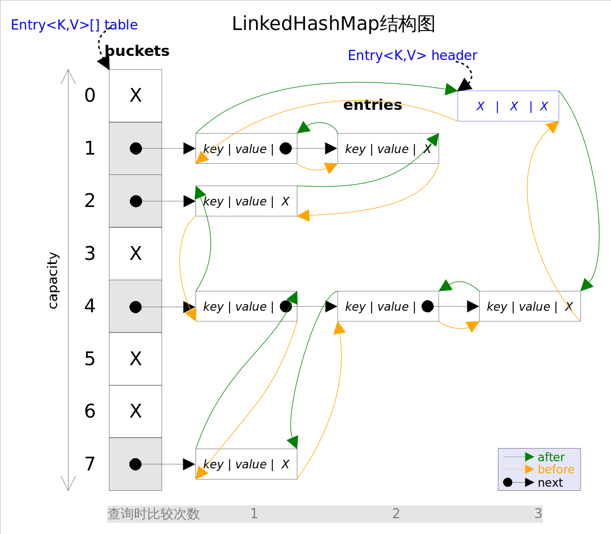

# 总体介绍
*LinkedHashSet*和*LinkedHashMap*在Java里也有着相同的实现，前者仅仅是对后者做了一层包装，也就是说***LinkedHashSet*里面有一个*LinkedHashMap*（适配器模式）**。

*LinkedHashMap*实现了*Map*接口，即允许放入`key`为`null`的元素，也允许插入`value`为`null`的元素。从名字上可以看出该容器是*linked list*和*HashMap*的混合体，也就是说它同时满足*HashMap*和*linked list*的某些特性。**可将*LinkedHashMap*看作采用*linked list*增强的*HashMap*。**

## 数据结构


事实上*LinkedHashMap*是*HashMap*的直接子类，**二者唯一的区别是*LinkedHashMap*在*HashMap*的基础上，采用双向链表（doubly-linked list）的形式将所有`entry`连接起来，这样是为保证元素的迭代顺序跟插入顺序相同**。上图给出了*LinkedHashMap*的结构图，主体部分跟*HashMap*完全一样，多了`header`指向双向链表的头部（是一个哑元），**该双向链表的迭代顺序就是`entry`的插入顺序**。

将对象放入到*LinkedHashMap*或*LinkedHashSet*中时，有两个方法需要特别关心：`hashCode()`和`equals()`。**`hashCode()`方法决定了对象会被放到哪个`bucket`里，当多个对象的哈希值冲突时，`equals()`方法决定了这些对象是否是“同一个对象”**。所以，如果要将自定义的对象放入到`LinkedHashMap`或`LinkedHashSet`中，需要*@Override*`hashCode()`和`equals()`方法。

## 并发
出于性能原因，*LinkedHashMap*是非同步的（not synchronized），如果需要在多线程环境使用，需要程序员手动同步；或者通过如下方式将*LinkedHashMap*包装成（wrapped）同步的：

`Map m = Collections.synchronizedMap(new LinkedHashMap(...));`

## 性能
有两个参数可以影响*LinkedHashMap*的性能：初始容量（inital capacity）和负载系数（load factor）。初始容量指定了初始`table`的大小，负载系数用来指定自动扩容的临界值。当`entry`的数量超过`capacity*load_factor`时，容器将自动扩容并重新哈希。对于插入元素较多的场景，将初始容量设大可以减少重新哈希的次数。

## 遍历
**迭代*LinkedHashMap*时不需要像*HashMap*那样遍历整个`table`，而只需要直接遍历`header`指向的双向链表即可**，也就是说*LinkedHashMap*的迭代时间就只跟`entry`的个数相关，而跟`table`的大小无关。


# 源码分析
LinkedHashMap中定义了Entry类继承自HashMap.Node<K,V>，增加了两个Entry类型的属性before和after，用来记录上一个和下一个entry，用来实现双向链表。
LinkedHashMap定义了两个LinkedHashMap.Entry类型的属性：head和tail,用来记录
## 成员变量
```java
public class LinkedHashMap<K,V>
    extends HashMap<K,V>
    implements Map<K,V>
{
    //存储映射的类
    static class Entry<K,V> extends HashMap.Node<K,V> {
        Entry<K,V> before, after;//前驱节点和后继节点的引用
        Entry(int hash, K key, V value, Node<K,V> next) {
            super(hash, key, value, next);
        }
    }
    
    //双向链表的头结点（最先添加的节点）
    transient LinkedHashMap.Entry<K,V> head;
    //双向链表的头结点（最后添加的节点）
    transient LinkedHashMap.Entry<K,V> tail;

    final boolean accessOrder; //false： 基于插入顺序   true:基于访问顺序
}
```
## 重要方法

## newNode()
LinkedList重写了newNode方法，在put方法中创建节点时，使用LinkedHashMap.Entry类来创建，然后调用linkNodeLast()方法，该方法的作用是将元素挂在双向链表的末尾，before和after在这个方法里被赋值。
```java
Node<K,V> newNode(int hash, K key, V value, Node<K,V> e) {
    LinkedHashMap.Entry<K,V> p =
        new LinkedHashMap.Entry<K,V>(hash, key, value, e);
    linkNodeLast(p);
    return p;
}
//将元素挂在双向链表的末尾
private void linkNodeLast(LinkedHashMap.Entry<K,V> p) {
    LinkedHashMap.Entry<K,V> last = tail;
    tail = p;
    if (last == null)
        head = p;
    else {
        p.before = last;
        last.after = p;
    }
}
```
## newTreeNode()
```java
TreeNode<K,V> newTreeNode(int hash, K key, V value, Node<K,V> next) {
    TreeNode<K,V> p = new TreeNode<K,V>(hash, key, value, next);
    linkNodeLast(p);
    return p;
}
```

## put()
`put(K key, V value)`方法是将指定的`key, value`对添加到`map`里。该方法使用`HashMap.get()`实现。

注意，这里的**插入有两重含义**：
> 1. 从`table`的角度看，新的`entry`需要插入到对应的`bucket`里，当有哈希冲突时，将新的`entry`插入到冲突链表的尾部。
> 2. 从`header`的角度看，新的`entry`需要插入到双向链表的尾部。

调用HashMap的put()方法，可以实现1,2的实现则放在了afterNodeAccess()中，该方法在HashMap中为空实现，LinkedHashMap重写了afterNodeAccess()方法。在添加完元素后，调用afterNodeAccess()的调整双向链表。

```java
// move node to last
void afterNodeAccess(Node<K,V> e) { 
    LinkedHashMap.Entry<K,V> last;
    if (accessOrder && (last = tail) != e) { //若元素已经位于双向链表最后一位，直接返回
        LinkedHashMap.Entry<K,V> p =
            (LinkedHashMap.Entry<K,V>)e, b = p.before, a = p.after;
        p.after = null;
        if (b == null)//获取的是双向链表头部元素
            head = a;
        else//获取的不是头部元素
            b.after = a;
        if (a != null) //获取的不是双向链表尾部元素
            a.before = b; 
        else //获取的是双向链表尾部元素
            last = b;
        
        if (last == null)//双向链表只有一个元素时会出现
            head = p;
        else {
            //将p挂在最后一个位置
            p.before = last;
            last.after = p;
        }
        tail = p;
        ++modCount;
    }
}
```
## get()

`get(Object key)`方法根据指定的`key`值返回对应的`value`。该方法通过调用HashMap中的getNode()方法实现。

LinkedHashMap提供两种排序方式，一种是插入顺序，一种是访问顺序。默认为插入顺序，若开启了访问顺序排序，通过put中的afterNodeAccess方法实现调整。

```java
public V get(Object key) {
    Node<K,V> e;
    if ((e = getNode(hash(key), key)) == null)
        return null;
    if (accessOrder)//基于访问顺序
        afterNodeAccess(e);
    return e.value;
}
```

## remove()

`remove(Object key)`的作用是删除`key`值对应的`entry`,LinkedHashMap未重写remove方法，所以调用的还是HashMap中的remove方法。

注意，这里的**删除也有两重含义**：
> 1. 从`table`的角度看，需要将该`entry`从对应的`bucket`里删除，如果对应的冲突链表不空，需要修改冲突链表的相应引用。
> 2. 从`header`的角度来看，需要将该`entry`从双向链表中删除，同时修改链表中前面以及后面元素的相应引用。

HashMap中的remove方法实现了1,2的实现则放在了afterNodeRemoval()中，该方法在HashMap中为空实现，LinkedHashMap重写了afterNodeRemoval()方法。

```java
void afterNodeRemoval(Node<K,V> e) { // unlink
    LinkedHashMap.Entry<K,V> p =
        (LinkedHashMap.Entry<K,V>)e, b = p.before, a = p.after;
    p.before = p.after = null;
    
    if (b == null)
        head = a; //若p是头部元素，head指向p的后继元素
    else
        b.after = a; 
    
    if (a == null)
        tail = b; //若p是尾部元素，tail指向p的前驱元素
    else
        a.before = b; 
}
```


# LinkedHashSet

前面已经说过*LinkedHashSet*是对*LinkedHashMap*的简单包装，对*LinkedHashSet*的函数调用都会转换成合适的*LinkedHashMap*方法，因此*LinkedHashSet*的实现非常简单，这里不再赘述。

```Java
public class LinkedHashSet<E>
    extends HashSet<E>
    implements Set<E>, Cloneable, java.io.Serializable {
    ......
    // LinkedHashSet里面有一个LinkedHashMap
    public LinkedHashSet(int initialCapacity, float loadFactor) {
        map = new LinkedHashMap<>(initialCapacity, loadFactor);
    }
	......
    public boolean add(E e) {//简单的方法转换
        return map.put(e, PRESENT)==null;
    }
    ......
}
```

# LinkedHashMap经典用法

*LinkedHashMap*除了可以保证迭代顺序外，还有一个非常有用的用法：可以轻松实现一个采用了FIFO替换策略的缓存。
具体说来，LinkedHashMap有一个子类方法`protected boolean removeEldestEntry(Map.Entry<K,V> eldest)`，该方法的作用是告诉Map是否要删除“最老”的Entry，所谓最老就是当前Map中最早插入的Entry，如果该方法返回`true`，最老的那个元素就会被删除。
在每次插入新元素的之后LinkedHashMap会自动询问removeEldestEntry()是否要删除最老的元素。这样只需要在子类中重载该方法，当元素个数超过一定数量时让removeEldestEntry()返回true，就能够实现一个固定大小的FIFO策略的缓存。示例代码如下：

```Java
/** 一个固定大小的FIFO替换策略的缓存 */
class FIFOCache<K, V> extends LinkedHashMap<K, V>{
    private final int cacheSize;
    public FIFOCache(int cacheSize){
        this.cacheSize = cacheSize;
    }

    // 当Entry个数超过cacheSize时，删除最老的Entry
    @Override
    protected boolean removeEldestEntry(Map.Entry<K,V> eldest) {
       return size() > cacheSize;
    }
}
```


## 迭代器

